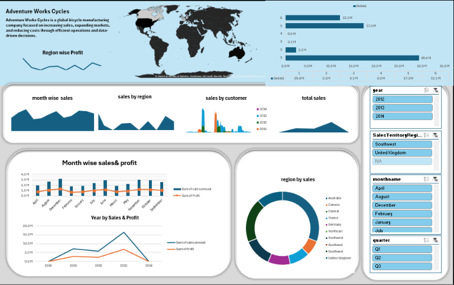
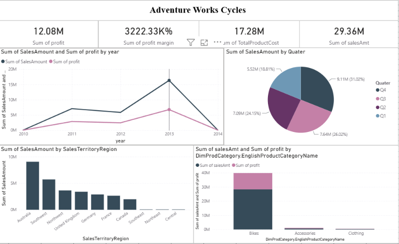
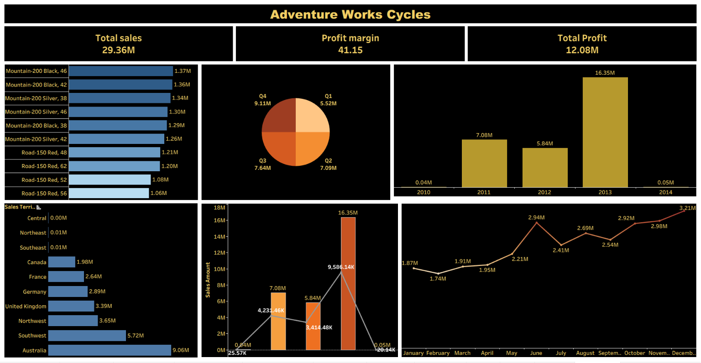

# Data Analytics Portfolio
## Project Overview
This repository contains a complete end-to-end Data Analytics project using the Adventure Works dataset.
The project demonstrates the complete analytics workflow from data preparation to dashboard creation and business insights using multiple tools.
---
## Tools Used
- Microsoft Excel
- SQL (MySQL)
- Power BI
- Tableau
- Git & GitHub
---
## Dataset
Adventure Works Sample Dataset
Tables Used
- FactInternetSales
- Fact_Internet_Sales_New
- DimCustomer
- DimDate
- DimProduct
- DimProductSubCategory
- DimSalesTerritory
---
## Project Workflow
1. Data Collection
2. Data Cleaning
3. Data Modeling
4. SQL Analysis
5. KPI Calculation
6. Dashboard Development
7. Business Insights
---
## Modules
### Excel
Features
- Data Cleaning
- Pivot Tables
- Pivot Charts
- KPI Cards
- Dashboard
- Slicers
- Lookup Functions

### SQL
Features
- Database Creation
- Table Creation
- Data Cleaning
- Joins
- Aggregations
- Stored Procedures
- Business Queries

### Power BI
Features
- Data Modeling
- Relationships
- DAX Measures
- KPI Cards
- Interactive Dashboard
- Slicers
- Drill Down

### Tableau
Features
- Interactive Dashboard
- KPI Visuals
- Maps
- Filters
- Trend Analysis
---

## Dashboard KPIs
- Total Sales
- Total Profit
- Profit Margin
- Sales by Territory
- Sales by Product
- Quarterly Sales
- Monthly Sales Trend
- Year-wise Sales
---

## Key Business Insights
- Australia generated the highest sales.
- 2013 recorded the highest yearly sales.
- Q4 was the best-performing quarter.
- Mountain bikes contributed the highest revenue.
- Sales increased during the last quarter of the year.
---

## Skills Demonstrated
- Excel
- SQL
- Power BI
- Tableau
- Data Cleaning
- Data Modeling
- DAX
- Dashboard Design
- Business Intelligence
- Data Visualization
---

## Repository Structure
Dataset/
Excel/
SQL/
PowerBI/
Tableau/
Documentation/
Images/
---# Dashboard Preview

## Excel Dashboard

---

## Power BI Dashboard

---

## Tableau Dashboard

## Author
Lalith Kaushik

Aspiring Data Analyst
